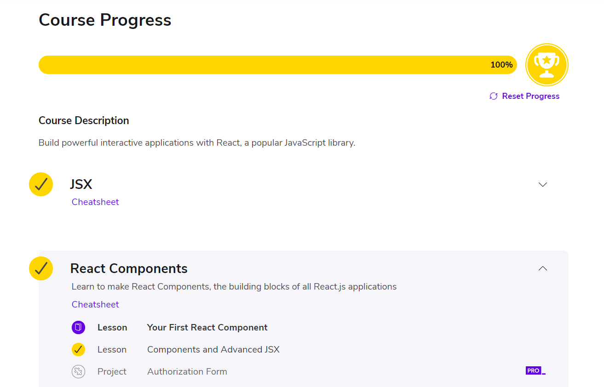
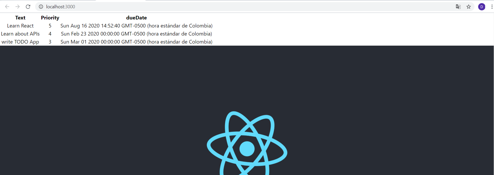
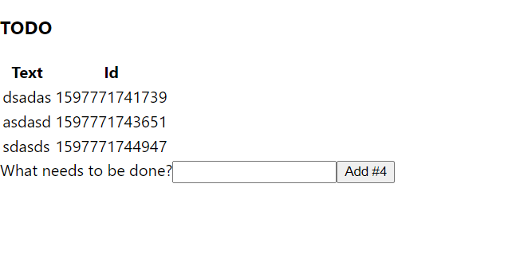

# Introducción a ReactJS Laboratorio 1
# Innovación y emprendimiento en tecnologías de información IETI
## Daniel Felipe Alfonso Bueno

## Código de Honor
La presencia de este documento en este repositorio es un compromiso explícito de los colaboradores de seguir el siguiente código de honor:

Debes seguir el Código de honor del ingeniero de sistemas para defender el estándar de integridad académica de la ECI:

- Tus respuestas a tareas, cuestionarios y exámenes deben ser tu propio trabajo (excepto para las tareas que permiten explícitamente la colaboración).

- No puedes compartir tus soluciones de tareas, cuestionarios o exámenes con otra persona a menos que el instructor lo permita explícitamente. Esto incluye cualquier cosa escrita por ti, como también cualquier solución oficial proporcionada por el docente o el monitor del curso.

- No puedes participar en otras actividades que mejorarán de manera deshonesta tus resultados o que mejorarán de manera deshonesta o dañarán los resultados de otras personas.
### Constancia de curso ReactJs

### Parte 2 Laboratorio

### Parte 3 Laboratorio

### Uso del Proyecto
Clonamos el proyecto en nuestro con el siguiente comando en consola:
~~~
git clone https://github.com/DanielAlfonso17/IETI-LAB1.git
~~~

Accedemos al directorio de nuestro proyecto, para ejecutarlo en consola escribimos:

Para descargar todas las dependencias 
~~~
npm install 
~~~
Para la ejecucion de nuestro proyecto: 
~~~
npm start
~~~
